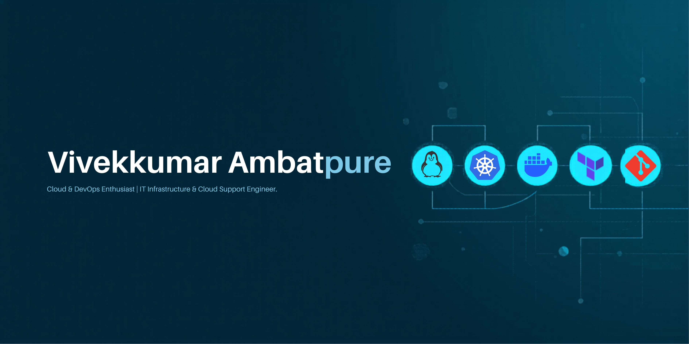

# 👋 Hello, I'm Vivekkumar Ambatpure!

Cloud & DevOps Enthusiast | IT Infrastructure & Cloud Support Engineer

Working with Azure-based identity and access management (Microsoft Entra ID, Azure Portal, Microsoft 365) in an enterprise environment. AWS Certified Cloud Practitioner with hands-on experience in troubleshooting and supporting cloud services.

Currently building skills in Linux, Git, Docker, CI/CD, and cloud infrastructure to transition into a DevOps Engineer role.

Passionate about automation, cloud technologies, and building scalable systems.

 ## 🚀 Skills & Technologies

☁️ Cloud & AWS Services:
- Amazon EC2
- Amazon S3
- VPC
- IAM
- CloudWatch
- AWS Lambda 
- API Gateway

🖥️ Operating Systems:
- Linux (user management, permissions, services, logs)
- shell scripting

🔁 DevOps & Automation:
- Git & GitHub
- CI/CD fundamentals
- GitHub Actions 
- Infrastructure monitoring & troubleshooting
- Jenkins
- Terraform
- Docker
- Kubernetes
- Ansible
  
💻 Programming & Scripting:
- Python 
- Bash scripting

📊 Monitoring & Operations:
- Cloud monitoring & alerts
- Log analysis
- Incident handling & troubleshooting
- System health checks

## 💼 Services I Provide

Cloud Infrastructure Support:
Managing and supporting AWS cloud resources such as EC2, S3, IAM, and VPC to ensure smooth operations.

Cloud Monitoring & Troubleshooting:
Monitoring cloud resources, identifying issues, and resolving performance or availability problems.

Linux System Administration:
Handling Linux servers including user management, permissions, services, and basic automation.

CI/CD & Version Control Support:
Working with Git, GitHub, and basic CI/CD pipelines to support application deployments.

Automation Support:
Using bash scripting, Terraform and AWS services to automate routine operational tasks.

Devops Tools:
Docker, Kubernetes, Ansible

## 📚 Learning & Growth

I strongly believe in continuous learning. I’m currently improving my skills in advanced AWS services, DevOps tools, automation, and system reliability. I enjoy learning through hands-on practice and real production scenarios.

## 🤝 Let's Connect

Feel free to connect with me on 🔗[LinkedIn](https://www.linkedin.com/in/nagesh.jaybhay)  
Check out my [Portfolio Website] 🌐(http://amaz-nagesh.s3-website.ap-south-1.amazonaws.com/#about)  
or reach out via email at 📧 [nageshjaybhaye123@gmail.com](nageshjaybhaye123@gmail.com).

I’m always open to discussing new opportunities, collaborations, or just connecting with fellow tech enthusiasts.

Thank you for visiting my profile!
khq-pdgu-nqg
